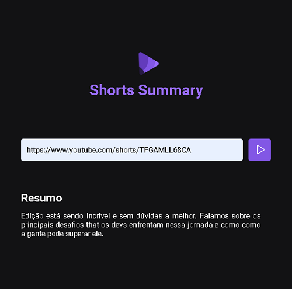

# Página web para prática HTML, CSS, JAVASCRIPT, NODE & IA.

[🔗 Clique aqui para acessar](https://henriqueapereira.github.io/nlw13/)

## 🛠️ Tecnologias

- HTML
- CSS
- Node
- Inteligência Artificial
- Git & Github

  Desenvolvido uma página web desde o front end até o back end com integração de uma
  inteligência artificial para realizar a transcrição de shorts do youtube para textos e resumi-los.

📧 ## Contato

- henriqueadrianopereira@gmail.com
- https://www.linkedin.com/in/henriqueadrianop/
